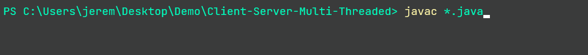
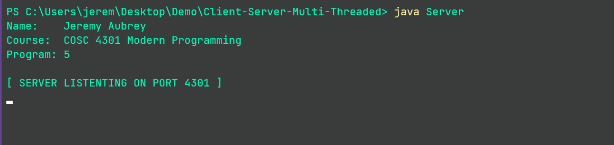
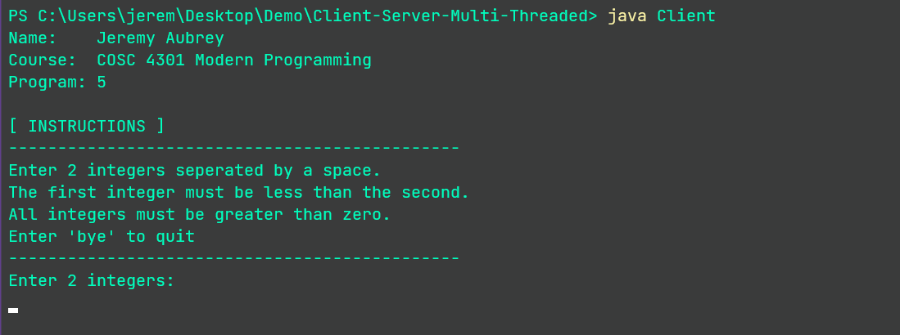
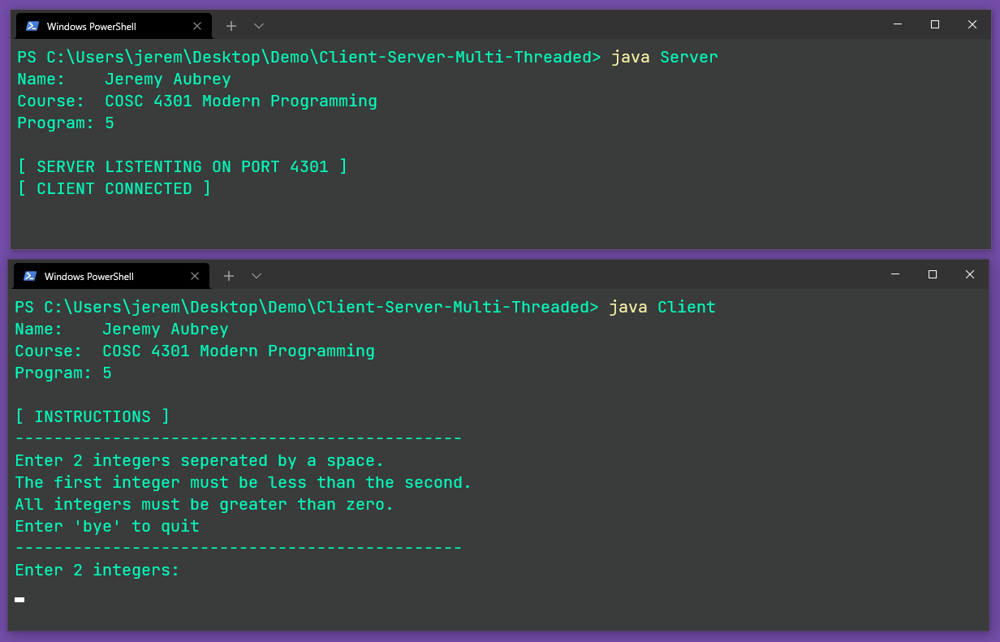
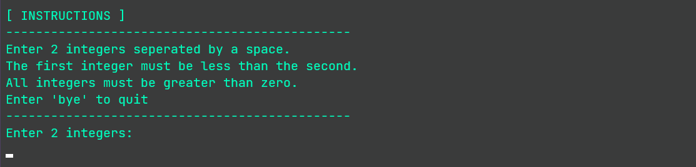
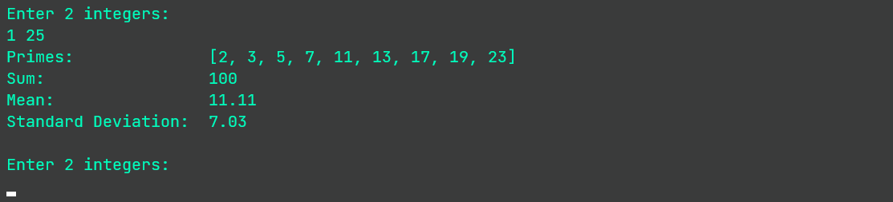
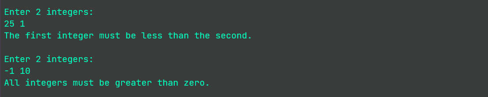
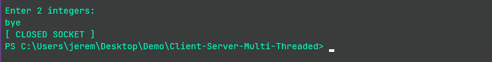
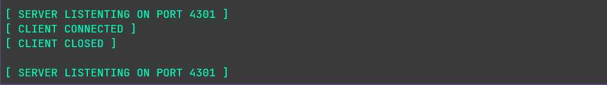

# Multi-threaded Client-Server Application

A multi-threaded server accepts integer data (2 integers) from a client and returns the following 
statistics to the client:

- Primes (within range of the integers)
- Sum (of primes)
- Mean (of primes)
- Standard Deviation (of primes)

Calculations are delegated to separate threads and results are aggregated, formatted, and returned 
to the client.

### To Build:
Download the java source code and run the following command in the same directory:
```powershell
javac *.java
```


### Run:
Start the server

```powershell
java Server
```



Start the client

```powershell
java Client
```



(both running on localhost for demo purposes)


### Use:
User is prompted with instructions and can enter integers to obtain statistics or enter 'bye' to quit program.

The data must be:

- 2 integers separated by a space
- The first integer must be less than the second
- Both integers must be greater than zero



--- 



---

(validation)


---

(exit program using 'bye')


---

Upon a client exiting, the server resumes listening for more clients

